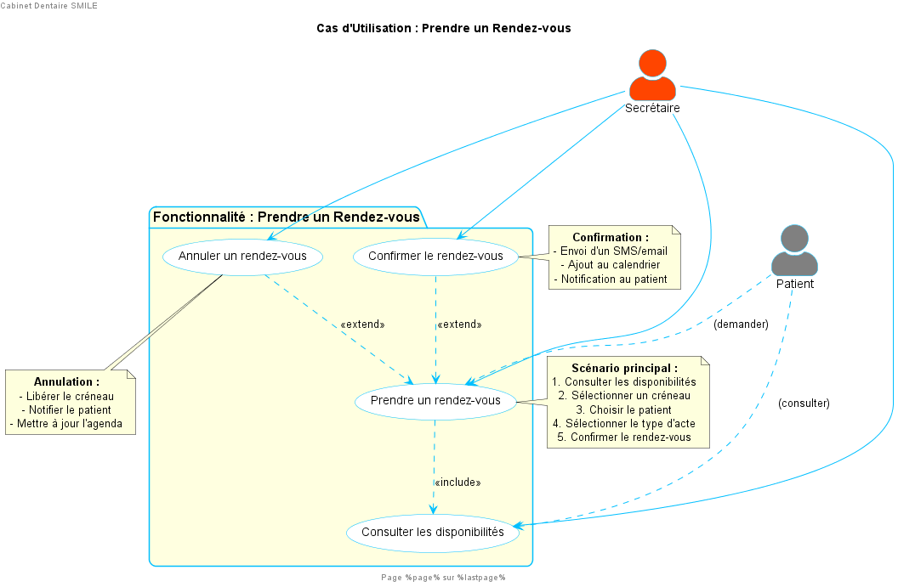
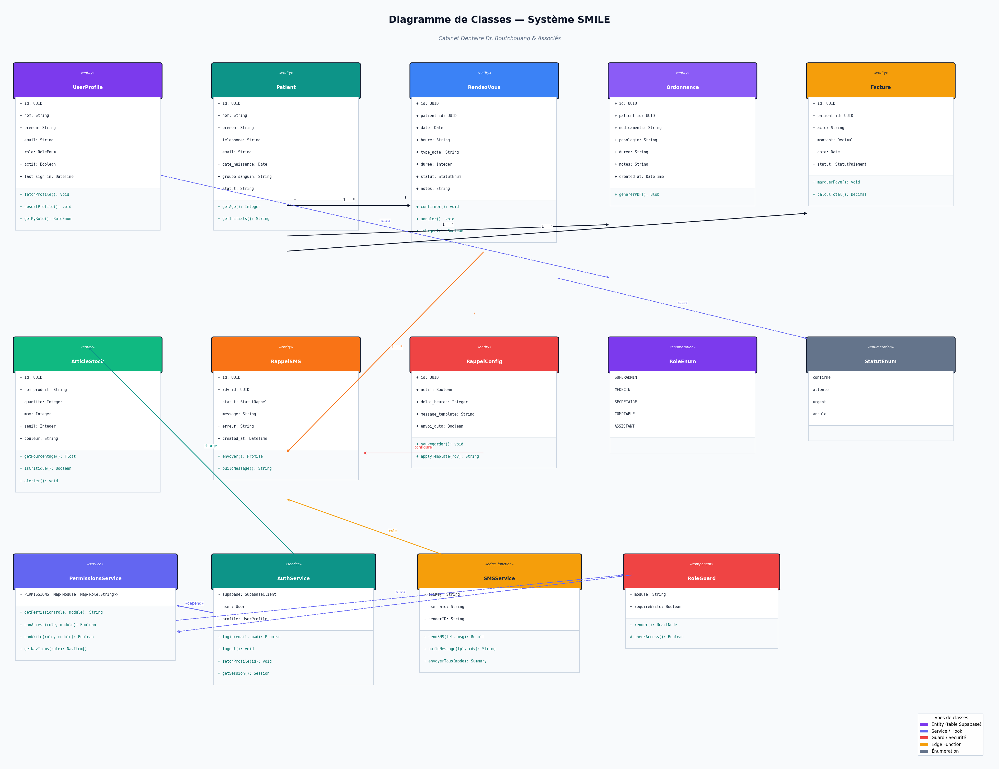
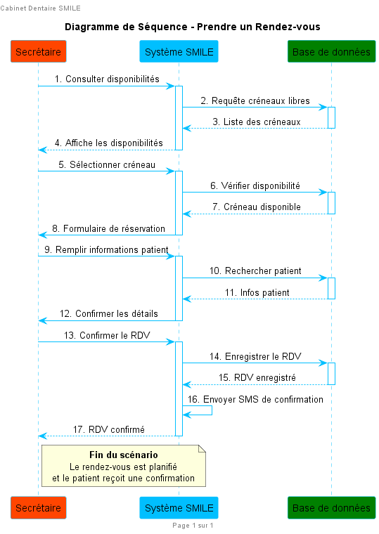
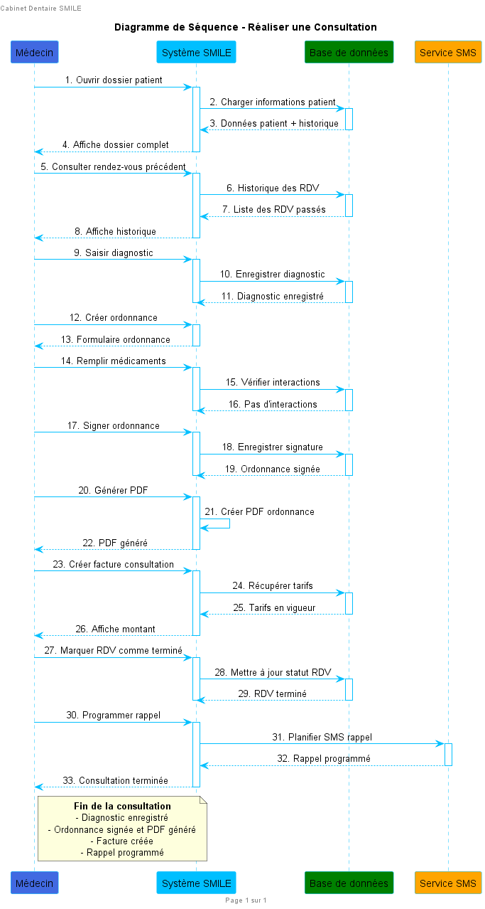
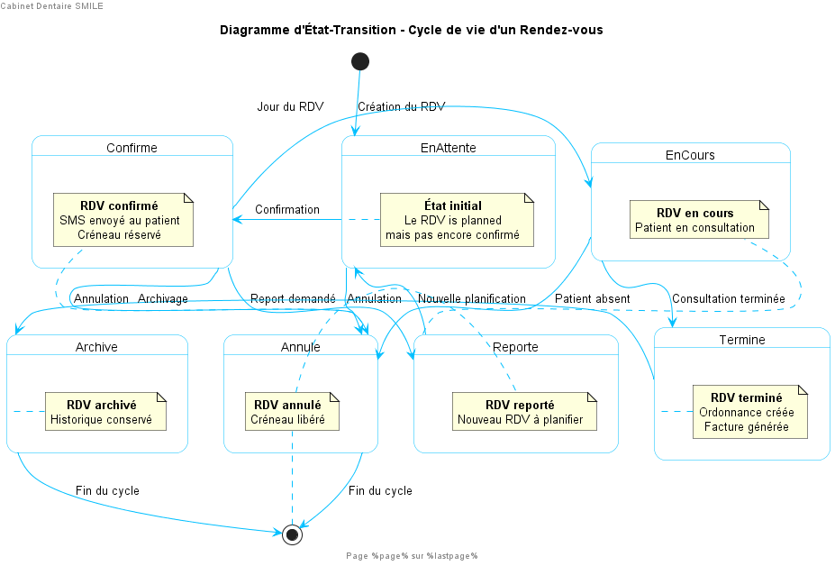
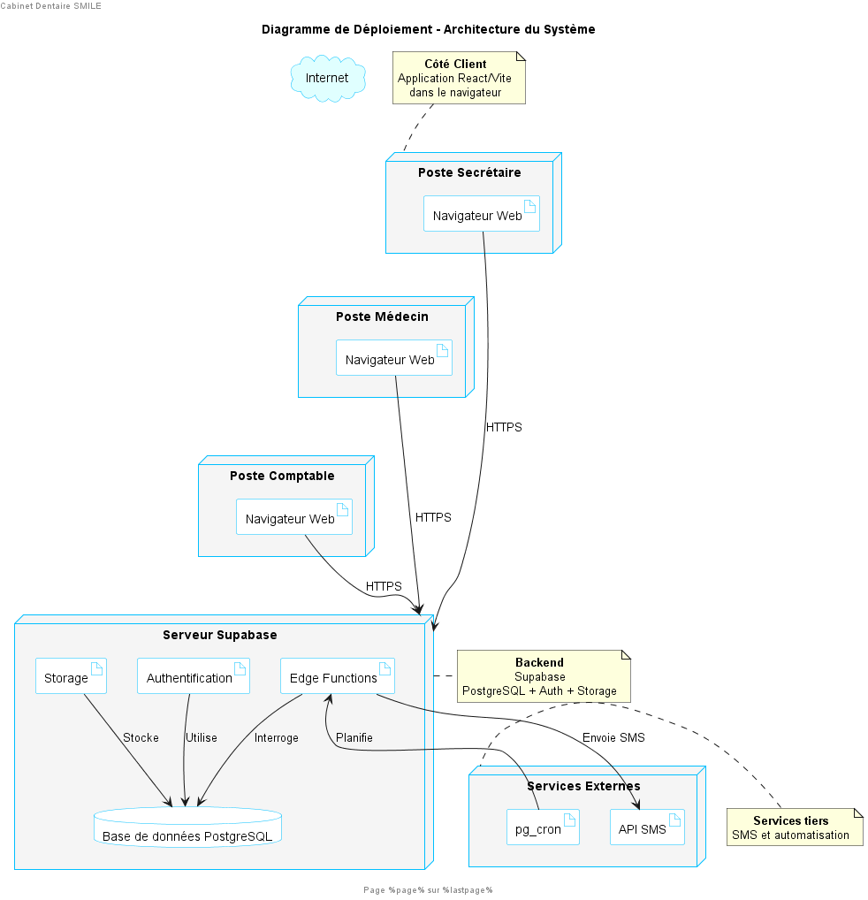

# RAPPORT DE STAGE ACADEMIQUE

## Theme

**Analyse, conception et implementation d'une application web de gestion d'un cabinet dentaire : cas du cabinet dentaire SMILE**

## Informations de l'etudiant

- **Nom :** KOM
- **Prenom :** [A completer]
- **Filiere :** Genie Informatique
- **Niveau :** [A completer]
- **Etablissement :** Institut Universitaire de Technologie FOTSO Victor de Bandjoun
- **Entreprise d'accueil :** DB Digital Agency
- **Encadreur academique :** [A completer]
- **Encadreur professionnel :** [A completer]
- **Annee academique :** 2025-2026

---

# DEDICACE

Je dedie ce travail a ma famille, pour son soutien moral, spirituel et materiel durant toute ma formation. Je le dedie egalement a mes proches et a toutes les personnes qui m'ont accompagne dans les moments d'effort, de doute et de progression.

---

# AVANT-PROPOS

Dans le cadre de la formation professionnelle des etudiants, l'Institut Universitaire de Technologie FOTSO Victor de Bandjoun prevoit une periode de stage academique permettant aux apprenants de confronter les connaissances theoriques acquises en classe aux realites du monde professionnel.

Ce stage constitue une etape importante dans la formation de l'etudiant en Genie Informatique, car il permet de developper des competences pratiques en analyse, conception, programmation, gestion de projet et integration de solutions numeriques. C'est dans ce cadre que nous avons effectue notre stage au sein de **DB Digital Agency**, une entreprise orientee vers les solutions digitales, la creation d'applications web et l'accompagnement des organisations dans leur transformation numerique.

Durant cette periode, nous avons travaille sur un projet intitule : **Analyse, conception et implementation d'une application web de gestion d'un cabinet dentaire**. Ce projet vise a proposer une solution moderne permettant d'ameliorer la gestion quotidienne d'un cabinet dentaire, notamment la gestion des patients, des rendez-vous, des ordonnances, de la facturation, du stock, des rappels SMS et des rapports d'activite.

---

# REMERCIEMENTS

La realisation de ce rapport est le fruit de plusieurs contributions. Nous adressons tout d'abord nos remerciements a Dieu Tout-Puissant pour la sante, la force et le courage qu'il nous a accordes tout au long de ce stage.

Nous exprimons notre profonde gratitude a l'Institut Universitaire de Technologie FOTSO Victor de Bandjoun, a son corps administratif et enseignant, pour la qualite de la formation recue.

Nos remerciements vont egalement a notre encadreur academique, **[Nom a completer]**, pour son orientation, ses remarques et son accompagnement dans la redaction du present rapport.

Nous remercions sincerement la direction de **DB Digital Agency** pour nous avoir accueillis au sein de son entreprise et pour nous avoir permis de participer a des travaux concrets dans le domaine du developpement web et de la transformation digitale.

Nous remercions notre encadreur professionnel, **[Nom a completer]**, pour sa disponibilite, ses conseils techniques et son suivi durant la realisation du projet.

Enfin, nous remercions nos parents, nos proches, nos camarades et toutes les personnes qui, de pres ou de loin, ont contribue a la reussite de ce stage.

---

# LISTE DES ABREVIATIONS

| Sigle | Designation |
|---|---|
| API | Application Programming Interface |
| BD | Base de donnees |
| CRUD | Create, Read, Update, Delete |
| CSS | Cascading Style Sheets |
| HTML | HyperText Markup Language |
| HTTP | HyperText Transfer Protocol |
| IUT-FV | Institut Universitaire de Technologie FOTSO Victor |
| JS | JavaScript |
| JSON | JavaScript Object Notation |
| PDF | Portable Document Format |
| RLS | Row Level Security |
| SMS | Short Message Service |
| SQL | Structured Query Language |
| UML | Unified Modeling Language |
| URL | Uniform Resource Locator |

---

# RESUME

La gestion manuelle des activites d'un cabinet dentaire peut entrainer des pertes de temps, des erreurs de planification, des difficultes de suivi des patients, des retards dans la facturation et une faible visibilite sur les performances du cabinet. Face a ces limites, la mise en place d'un systeme informatique centralise devient une necessite pour ameliorer l'organisation interne et la qualite du service rendu aux patients.

Dans le cadre de notre stage de deuxieme annee de DUT a l'IUT-FV de Bandjoun, nous avons integre l'entreprise **DB DIGITAL AGENCY**, une societe basee a Yaounde, experte dans les technologies de l'information et la transformation numerique des entreprises. Au sein de cette structure, nous avons travaille sur l'analyse, la conception et l'implementation d'une application web de gestion du cabinet dentaire **SMILE**. Cette solution permet de gerer les patients, les rendez-vous, les ordonnances, les factures, le stock, les rappels SMS, les rapports statistiques ainsi que les utilisateurs selon leurs roles.

La solution a ete developpee avec **React 18**, **Vite**, **Tailwind CSS** et **Supabase**, qui assure l'authentification, la base de donnees PostgreSQL, les politiques de securite et les fonctions serveur. Le systeme propose une interface responsive, un tableau de bord, des modules de gestion metier et un mecanisme de controle d'acces base sur les roles : superadmin, medecin, secretaire, comptable et assistant.

Ce rapport presente le cadre du stage, l'analyse du besoin, la conception UML, les choix techniques, les principales fonctionnalites implementees, les difficultes rencontrees ainsi que les perspectives d'amelioration.

**Mots-cles :** cabinet dentaire, gestion, React, Supabase, rendez-vous, patients, facturation, rappels SMS.

---

# ABSTRACT

Manual management in a dental clinic can lead to time loss, scheduling errors, poor patient follow-up, billing delays and limited visibility on daily performance. To overcome these limitations, a centralized information system becomes necessary to improve internal organization and service quality.

As part of our second-year DUT internship at IUT-FV of Bandjoun, we joined **DB DIGITAL AGENCY**, a company based in Yaounde and specialized in information technologies and the digital transformation of businesses. Within this company, we worked on the analysis, design and implementation of a web application for managing the **SMILE** dental clinic. The system manages patients, appointments, prescriptions, invoices, stock, SMS reminders, statistical reports and users according to their roles.

The solution was developed using **React 18**, **Vite**, **Tailwind CSS** and **Supabase**, which provides authentication, PostgreSQL database services, security policies and serverless functions. The application offers a responsive interface, a dashboard, business management modules and role-based access control for superadmin, doctor, secretary, accountant and assistant profiles.

This report presents the internship environment, needs analysis, UML design, technical choices, implemented features, encountered difficulties and future improvements.

**Keywords:** dental clinic, management, React, Supabase, appointments, patients, billing, SMS reminders.

---

# SOMMAIRE

- Introduction generale
- Chapitre I : Presentation de l'entreprise et deroulement du stage
- Chapitre II : Analyse et conception
- Chapitre III : Conception et implementation des resultats
- Remarques et suggestions
- Liste des figures
- Liste des tableaux
- Conclusion generale
- Bibliographie et webographie
- Annexes

---

# LISTE DES FIGURES

| Numero | Titre | Page |
|---|---|---|
| Figure 1 | Diagramme de cas d'utilisation - Prendre un rendez-vous | A completer |
| Figure 2 | Diagramme de classes du systeme SMILE | A completer |
| Figure 3 | Diagramme de sequence - Prendre un rendez-vous | A completer |
| Figure 4 | Diagramme de sequence - Consultation | A completer |
| Figure 5 | Diagramme d'etat-transition d'un rendez-vous | A completer |
| Figure 6 | Diagramme de deploiement de l'application SMILE | A completer |

---

# LISTE DES TABLEAUX

| Numero | Titre | Page |
|---|---|---|
| Tableau 1 | Liste des abreviations | A completer |
| Tableau 2 | Besoins fonctionnels du systeme SMILE | A completer |
| Tableau 3 | Technologies utilisees | A completer |

---

# INTRODUCTION GENERALE

L'evolution des technologies de l'information a profondement transforme le fonctionnement des organisations. Dans le domaine de la sante, les solutions numeriques permettent aujourd'hui d'ameliorer la qualite du suivi des patients, de reduire les erreurs administratives et de faciliter l'acces aux informations essentielles.

Les cabinets dentaires, comme plusieurs structures medicales, manipulent quotidiennement des donnees sensibles : identite des patients, rendez-vous, actes medicaux, ordonnances, factures et informations liees aux stocks de consommables. Lorsque ces donnees sont gerees manuellement ou a l'aide d'outils disperses, le cabinet peut etre confronte a des lenteurs, des doublons, des oublis de rendez-vous, des pertes de documents et des difficultes de production de rapports fiables.

C'est dans cette perspective que s'inscrit notre projet de stage : **analyser, concevoir et implementer une application web de gestion d'un cabinet dentaire**. Le projet, nomme **SMILE**, vise a centraliser les operations du cabinet dans une plateforme unique, securisee et accessible selon les responsabilites de chaque utilisateur.

Le present rapport est organise en trois chapitres. Le premier presente l'entreprise d'accueil et le deroulement du stage. Le deuxieme porte sur l'analyse du besoin et la conception du systeme. Le troisieme decrit les choix techniques, l'implementation de la solution et les resultats obtenus.

---

# CHAPITRE I : PRESENTATION DE L'ENTREPRISE ET DEROULEMENT DU STAGE

## I.1 Presentation de DB Digital Agency

**DB Digital Agency** est une agence digitale specialisee dans l'accompagnement des entreprises et organisations dans leur transformation numerique. D'apres le dossier de presentation fourni, l'entreprise communique autour de son positionnement d'agence capable de proposer des solutions digitales adaptees aux besoins des clients. Son site web indique l'adresse suivante : **https://www.dbdigitalagency.com**.

L'entreprise intervient principalement dans les domaines suivants :

- conception et developpement de sites web ;
- developpement d'applications web ;
- strategie digitale ;
- communication visuelle ;
- accompagnement des entreprises dans la digitalisation de leurs services ;
- creation de supports de communication numerique.

Dans le cadre de notre stage, DB Digital Agency nous a permis d'evoluer dans un environnement professionnel oriente projet, avec des travaux pratiques lies a l'analyse des besoins, a la conception fonctionnelle et technique, puis au developpement d'une application web.

## I.2 Missions et objectifs de l'entreprise

La mission principale de DB Digital Agency est d'aider les organisations a renforcer leur presence numerique et a optimiser leurs processus a travers des solutions technologiques. L'entreprise cherche a apporter des reponses concretes aux problemes de gestion, de communication et de visibilite des structures clientes.

Ses objectifs peuvent etre resumes comme suit :

- proposer des solutions digitales modernes et efficaces ;
- accompagner les entreprises dans l'automatisation de leurs activites ;
- concevoir des interfaces ergonomiques et adaptees aux utilisateurs ;
- ameliorer la visibilite des clients sur les canaux numeriques ;
- favoriser l'innovation et la productivite par l'usage des technologies web.

## I.3 Deroulement du stage

Le stage s'est deroule autour de plusieurs activites complementaires :

- prise de connaissance de l'entreprise et de ses methodes de travail ;
- analyse du contexte du cabinet dentaire SMILE ;
- identification des besoins fonctionnels et non fonctionnels ;
- conception des diagrammes UML ;
- modelisation de la base de donnees ;
- developpement de l'interface web ;
- integration de Supabase pour l'authentification, la base de donnees et la securite ;
- tests fonctionnels des principaux modules ;
- redaction de la documentation du projet.

## I.4 Apports du stage

Ce stage nous a permis de renforcer nos competences en developpement web moderne, en analyse de projet informatique et en conception de systemes d'information. Il nous a aussi permis de mieux comprendre les attentes d'une entreprise digitale, notamment la necessite de livrer des solutions utiles, ergonomiques, securisees et maintenables.

---

# CHAPITRE II : ANALYSE ET CONCEPTION

## II.1 Etude de l'existant

Dans plusieurs cabinets dentaires, les informations sont encore gerees de maniere manuelle ou semi-informatisee. Les rendez-vous peuvent etre notes dans des cahiers, les dossiers patients stockes dans des fichiers separes, les factures produites manuellement et les stocks suivis sans systeme d'alerte automatise.

Cette organisation presente plusieurs limites :

- perte ou duplication d'informations ;
- difficulte a retrouver rapidement un patient ;
- risques d'oubli ou de conflit dans les rendez-vous ;
- suivi financier peu precis ;
- absence de statistiques fiables ;
- mauvaise anticipation des ruptures de stock ;
- manque de tracabilite sur les actions des utilisateurs.

## II.2 Problematique

La problematique principale peut etre formulee ainsi :

**Comment concevoir et implementer une application web permettant de centraliser, securiser et automatiser la gestion quotidienne d'un cabinet dentaire ?**

## II.3 Analyse fonctionnelle et technique

Cette partie presente l'analyse fonctionnelle et technique du systeme SMILE. Elle permet d'identifier les objectifs du projet, les besoins des utilisateurs, les acteurs qui interagissent avec l'application, ainsi que les diagrammes UML produits lors de la phase de conception.

### II.3.1 Objectif general

L'objectif general du projet est de mettre en place une application web capable de faciliter la gestion administrative, medicale et financiere d'un cabinet dentaire.

### II.3.2 Objectifs specifiques

Les objectifs specifiques sont les suivants :

- gerer les comptes utilisateurs et les roles ;
- enregistrer, modifier, rechercher et supprimer les patients ;
- planifier et suivre les rendez-vous ;
- creer et exporter des ordonnances ;
- gerer la facturation des actes dentaires ;
- suivre le stock des produits et consommables ;
- automatiser ou declencher des rappels SMS ;
- produire des rapports statistiques sur l'activite du cabinet ;
- securiser l'acces aux modules selon le profil utilisateur.

### II.3.3 Analyse des besoins fonctionnels

Le systeme SMILE comporte les modules suivants :

| Module | Description |
|---|---|
| Authentification | Connexion securisee des utilisateurs |
| Tableau de bord | Vue synthetique des indicateurs du cabinet |
| Patients | Gestion des informations personnelles et administratives |
| Rendez-vous | Planification, modification, annulation et filtrage des RDV |
| Ordonnances | Creation et generation PDF des prescriptions |
| Facturation | Suivi des factures, montants payes et montants en attente |
| Stock | Gestion des produits, quantites et seuils critiques |
| Rappels SMS | Configuration et historique des rappels de rendez-vous |
| Rapports | Graphiques et indicateurs sur les revenus, patients et actes |
| Utilisateurs | Gestion des profils et permissions |

### II.3.4 Besoins non fonctionnels

Le systeme doit respecter les exigences suivantes :

- **Securite :** acces controle par role et protection des donnees sensibles ;
- **Ergonomie :** interface claire, responsive et facile a utiliser ;
- **Performance :** chargement rapide des pages et des donnees ;
- **Maintenabilite :** organisation modulaire du code ;
- **Disponibilite :** application accessible via navigateur ;
- **Fiabilite :** reduction des erreurs de saisie et validation des champs.

### II.3.5 Acteurs du systeme

Les principaux acteurs sont :

- **Superadmin :** dispose de tous les droits, y compris la gestion des utilisateurs ;
- **Medecin :** gere les patients, les rendez-vous, les ordonnances et consulte certains rapports ;
- **Secretaire :** gere les patients, rendez-vous, factures, stock et rappels ;
- **Comptable :** gere la facturation et consulte les rapports financiers ;
- **Assistant dentaire :** consulte les patients et rendez-vous, et peut participer a la gestion du stock.

### II.3.6 Diagrammes UML

Les diagrammes UML suivants ont ete realises dans le cadre de la conception du projet. Ils sont disponibles dans le dossier `docs` du projet sous forme de fichiers sources PlantUML (`.puml`) et d'images (`.png`).

#### a) Diagramme de cas d'utilisation

Le diagramme de cas d'utilisation presente les interactions entre les acteurs et le systeme. Dans le cadre du projet SMILE, il met principalement en evidence le processus de prise, de confirmation et d'annulation d'un rendez-vous.



#### b) Diagramme de classes

Le diagramme de classes represente la structure statique du systeme. Il met en relation les principales entites de l'application : utilisateur, patient, rendez-vous, ordonnance, facture, produit et rappel SMS.



#### c) Diagramme de sequence - Prise de rendez-vous

Le diagramme de sequence de prise de rendez-vous decrit les echanges entre la secretaire, le systeme SMILE et la base de donnees lors de la planification d'un rendez-vous.



#### d) Diagramme de sequence - Consultation

Ce diagramme illustre le deroulement d'une consultation, depuis l'identification du patient jusqu'a la production des documents et informations associes.



#### e) Diagramme d'etat-transition

Le diagramme d'etat-transition presente l'evolution possible de l'etat d'un rendez-vous : en attente, confirme, urgent ou annule.



#### f) Diagramme de deploiement

Le diagramme de deploiement montre l'organisation technique de la solution, notamment le poste utilisateur, l'application web, Supabase, la base de donnees PostgreSQL et les fonctions serveur.



## II.4 Modele de donnees

La base de donnees repose sur les principales tables suivantes :

- `users_profiles` : informations des utilisateurs et roles ;
- `patients` : informations des patients ;
- `rendez_vous` : planification des rendez-vous ;
- `ordonnances` : prescriptions medicales ;
- `factures` : facturation des actes ;
- `stock` : produits et consommables ;
- `rappels_sms` : historique des rappels ;
- `rappels_config` : configuration des rappels.

Les relations principales sont les suivantes :

- un patient peut avoir plusieurs rendez-vous ;
- un patient peut recevoir plusieurs ordonnances ;
- un patient peut recevoir plusieurs factures ;
- un rendez-vous peut declencher un rappel SMS ;
- les utilisateurs agissent sur les modules selon leur role.

---

# CHAPITRE III : CONCEPTION ET IMPLEMENTATION DES RESULTATS

## III.1 Architecture technique

L'application SMILE est une application web monopage construite avec React. Elle communique avec Supabase pour l'authentification, le stockage des donnees et l'execution de fonctions serveur.

L'architecture generale comprend :

- **Frontend :** React 18, React Router, Tailwind CSS ;
- **Backend as a Service :** Supabase ;
- **Base de donnees :** PostgreSQL ;
- **Securite :** authentification Supabase et politiques RLS ;
- **Fonctions serveur :** Edge Functions pour l'envoi de rappels ;
- **Generation PDF :** jsPDF, html2canvas et outils PDF ;
- **Graphiques :** Recharts.

## III.2 Structure du projet

Le projet est organise comme suit :

```text
smile/
├── src/
│   ├── components/
│   ├── pages/
│   ├── hooks/
│   ├── lib/
│   ├── utils/
│   └── data/
├── docs/
├── supabase/
├── public/
├── package.json
└── supabase_schema_complet.sql
```

## III.3 Presentation des interfaces et technologies utilisees

Cette partie presente les principales interfaces realisees dans l'application SMILE. Ces interfaces constituent la partie visible du systeme et permettent aux utilisateurs d'interagir avec les differents modules selon leur role.

### III.3.1 Interface d'authentification

L'interface d'authentification est la premiere page accessible lors du lancement de l'application. Elle permet a un utilisateur autorise de se connecter au systeme a l'aide de son adresse email et de son mot de passe.

Cette interface joue un role important dans la securisation de l'application, car elle empeche l'acces direct aux donnees du cabinet sans identification prealable. Lorsqu'un utilisateur soumet ses identifiants, ceux-ci sont verifies par le service d'authentification de Supabase. En cas d'echec, un message d'erreur est affiche afin d'informer l'utilisateur que les informations saisies sont incorrectes.

L'interface d'authentification comprend principalement :

- le logo ou l'identite visuelle du cabinet SMILE ;
- un champ de saisie de l'adresse email ;
- un champ de saisie du mot de passe ;
- une option permettant d'afficher ou de masquer le mot de passe ;
- un bouton de connexion ;
- un message d'erreur en cas d'identifiants invalides.

Apres une connexion reussie, l'utilisateur est redirige vers l'espace correspondant a son profil. Les modules visibles dependent alors du role qui lui est attribue : superadmin, medecin, secretaire, comptable ou assistant.

### III.3.2 Interface d'inscription

L'interface d'inscription correspond, dans le contexte du projet SMILE, a la creation d'un nouvel utilisateur par l'administrateur. Le systeme ne prevoit pas une inscription libre du public, car les donnees gerees sont sensibles et concernent un cabinet dentaire. La creation des comptes doit donc rester controlee par un utilisateur autorise.

A travers le module Utilisateurs, l'administrateur peut enregistrer un nouveau compte en renseignant les informations necessaires :

- le nom ;
- le prenom ;
- l'adresse email ;
- le role de l'utilisateur ;
- le statut du compte.

Cette interface permet de limiter les acces au systeme et de garantir que chaque utilisateur dispose uniquement des droits correspondant a ses responsabilites dans le cabinet. Par exemple, un medecin peut acceder aux patients et aux ordonnances, tandis qu'un comptable intervient principalement sur la facturation et les rapports financiers.

### III.3.3 Page d'accueil administrateur

Une fois connecte, l'administrateur accede a une interface centralisee lui permettant de gerer toutes les entites du systeme. Cette page d'accueil agit comme un tableau de bord avec des liens directs vers les differentes sections de gestion. Voici un apercu detaille de chaque fonctionnalite :

- **Gestion des patients :** ajout, modification, recherche et suppression des patients du cabinet ;
- **Gestion des rendez-vous :** planification, modification, filtrage et annulation des rendez-vous ;
- **Gestion des ordonnances :** creation et generation des prescriptions medicales au format PDF ;
- **Gestion de la facturation :** creation des factures, suivi des montants payes et des paiements en attente ;
- **Gestion du stock :** suivi des produits, quantites disponibles et seuils critiques ;
- **Gestion des rappels SMS :** configuration des messages, historique des envois et declenchement manuel des rappels ;
- **Gestion des rapports :** consultation des statistiques relatives aux revenus, aux patients, aux actes et aux rendez-vous ;
- **Gestion des utilisateurs :** creation, modification, activation ou desactivation des comptes utilisateurs.

Cette page d'accueil permet ainsi a l'administrateur d'avoir une vision globale de l'activite du cabinet. Elle affiche aussi des indicateurs utiles tels que le nombre de patients, les rendez-vous du jour, les urgences et le chiffre d'affaires mensuel. Elle constitue donc le centre de pilotage de l'application.

### III.3.4 Technologies utilisees

| Technologie | Role |
|---|---|
| React 18 | Construction de l'interface utilisateur |
| Vite | Environnement de developpement rapide |
| Tailwind CSS | Mise en forme responsive |
| React Router | Navigation entre les pages |
| Supabase | Authentification, base de donnees et securite |
| PostgreSQL | Stockage relationnel des donnees |
| Recharts | Visualisation statistique |
| jsPDF / html2canvas | Generation de documents PDF |

## III.4 Implementation des modules

### III.4.1 Authentification et gestion des roles

Le systeme utilise Supabase Auth pour identifier les utilisateurs. Chaque utilisateur possede un profil dans la table `users_profiles`, avec un role parmi : superadmin, medecin, secretaire, comptable ou assistant.

Les permissions sont centralisees dans le fichier `src/lib/roles.js`. Chaque module de l'application verifie le role de l'utilisateur avant d'autoriser l'affichage ou la modification des donnees.

### III.4.2 Tableau de bord

Le tableau de bord presente une vue synthetique de l'activite du cabinet :

- nombre total de patients ;
- rendez-vous du jour ;
- chiffre d'affaires mensuel ;
- urgences ;
- notifications ;
- graphiques de revenus ;
- apercu du stock et des patients recents.

### III.4.3 Gestion des patients

Le module Patients permet :

- l'ajout d'un patient ;
- la modification des informations ;
- la suppression d'un patient ;
- la recherche par nom, prenom ou telephone ;
- l'affichage du statut du patient.

Les informations gerees incluent le nom, le prenom, le telephone, l'adresse, l'email, la date de naissance, le groupe sanguin et le statut.

### III.4.4 Gestion des rendez-vous

Le module Rendez-vous permet :

- de creer un nouveau rendez-vous ;
- de modifier un rendez-vous existant ;
- d'annuler ou supprimer un rendez-vous ;
- de filtrer les rendez-vous par statut ;
- de suivre les rendez-vous du jour.

Les statuts prevus sont : confirme, en attente, urgent et annule.

### III.4.5 Gestion des ordonnances

Le module Ordonnances permet au medecin de creer des prescriptions pour un patient. Il prend en charge les medicaments, la posologie, la duree, les notes et le medecin traitant. L'application permet egalement de generer ou previsualiser une ordonnance au format PDF.

### III.4.6 Gestion de la facturation

Le module Facturation gere les actes dentaires, les montants, les dates et les statuts des paiements. Il permet de suivre :

- le total facture ;
- le montant encaisse ;
- le montant en attente ;
- les factures payees, en attente ou annulees.

### III.4.7 Gestion du stock

Le module Stock permet de suivre les produits et consommables du cabinet. Chaque produit possede une quantite, une quantite maximale, un seuil d'alerte et une couleur d'identification. Lorsque la quantite devient inferieure ou egale au seuil, le systeme signale un stock critique.

### III.4.8 Rappels SMS

Le module Rappels SMS permet de configurer un message de rappel, de suivre l'historique des envois et de declencher des rappels manuels. Une fonction serveur Supabase peut etre utilisee pour automatiser l'envoi des rappels avant les rendez-vous.

### III.4.9 Rapports statistiques

Le module Rapports fournit des indicateurs sur :

- les revenus mensuels ;
- les objectifs financiers ;
- l'evolution des patients ;
- la repartition des actes ;
- le taux de recouvrement ;
- le taux de rendez-vous honores.

## III.5 Securite des donnees

La securite repose sur deux niveaux :

- controle d'acces cote interface, grace aux roles definis dans l'application ;
- controle d'acces cote base de donnees, grace aux politiques RLS de Supabase.

Ainsi, un utilisateur ne voit que les modules autorises par son role, et les operations en base de donnees sont egalement limitees selon les droits prevus.

## III.6 Resultats obtenus

A l'issue du developpement, l'application permet de centraliser les operations essentielles d'un cabinet dentaire. Les resultats obtenus sont :

- une interface web responsive ;
- un systeme d'authentification ;
- une gestion des roles ;
- un tableau de bord dynamique ;
- une gestion complete des patients ;
- une gestion des rendez-vous ;
- une generation d'ordonnances ;
- une facturation structuree ;
- une gestion de stock avec alertes ;
- des rappels SMS configurables ;
- des rapports visuels.

## III.7 Difficultes rencontrees

Durant la realisation du projet, plusieurs difficultes ont ete rencontrees :

- definition precise des besoins du cabinet ;
- organisation des droits d'acces selon les roles ;
- modelisation des relations entre patients, rendez-vous, factures et ordonnances ;
- integration de Supabase avec les hooks React ;
- generation fiable de documents PDF ;
- adaptation de l'interface aux ecrans mobiles ;
- gestion des messages d'erreur et des validations de formulaire.

## III.8 Remarques et suggestions

Le projet constitue une base solide pour la digitalisation d'un cabinet dentaire. Toutefois, certaines ameliorations peuvent etre envisagees :

- ajouter un dossier medical detaille par patient ;
- integrer un calendrier visuel plus avance ;
- connecter un fournisseur SMS local adapte au Cameroun ;
- ajouter un module de caisse ;
- mettre en place un systeme de sauvegarde automatique ;
- ajouter un journal d'audit des actions utilisateurs ;
- permettre l'export Excel/PDF des rapports ;
- ajouter une version mobile optimisee pour les assistants et secretaires.

---

# CONCLUSION GENERALE

Ce stage academique effectue au sein de DB Digital Agency nous a permis de participer a la realisation d'une solution concrete repondant a un besoin professionnel : la gestion informatisee d'un cabinet dentaire.

Le projet SMILE nous a amene a parcourir plusieurs etapes importantes du cycle de developpement logiciel, notamment l'analyse du besoin, la conception UML, la modelisation de la base de donnees, le developpement de l'interface, l'integration de Supabase, la securisation des acces et la mise en place de fonctionnalites metier.

Au terme de ce travail, nous avons obtenu une application web capable de gerer les patients, les rendez-vous, les ordonnances, la facturation, le stock, les rappels SMS, les rapports et les utilisateurs. Cette solution contribue a ameliorer l'organisation du cabinet, a reduire les erreurs manuelles et a offrir une meilleure visibilite sur l'activite.

Ce stage a ete une experience enrichissante, tant sur le plan technique que professionnel. Il nous a permis de renforcer nos competences en developpement web, en conception de systemes d'information et en gestion de projet.

---

# BIBLIOGRAPHIE ET WEBOGRAPHIE

- Documentation React : https://react.dev
- Documentation Vite : https://vitejs.dev
- Documentation Supabase : https://supabase.com/docs
- Documentation Tailwind CSS : https://tailwindcss.com/docs
- Documentation Recharts : https://recharts.org
- Site DB Digital Agency : https://www.dbdigitalagency.com
- Dossier de presentation DB Digital Agency fourni par l'entreprise
- Code source du projet SMILE

---

# ANNEXES

## Annexe 1 : Liste des pages de l'application

- Login
- Dashboard
- Patients
- Rendez-vous
- Ordonnances
- Facturation
- Stock
- Rappels SMS
- Rapports
- Utilisateurs

## Annexe 2 : Liste des diagrammes UML

- Cas d'utilisation : prise de rendez-vous
- Diagramme de classes
- Diagramme de sequence
- Diagramme de sequence consultation
- Diagramme d'etat-transition
- Diagramme de deploiement

## Annexe 3 : Captures d'ecran a inserer

- Page de connexion
- Tableau de bord
- Liste des patients
- Formulaire de rendez-vous
- Module facturation
- Module stock
- Module rapports
- Module utilisateurs
